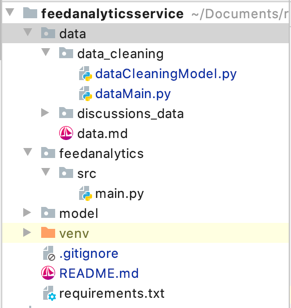

# FeedAnalyticsService


## Project Structure

- `data` : This directory will contain training and test data and `data cleaning` scripts
- `feedanalytics` : This directory will contains code for starting feedanalytics service
- `model` : This directory  will contain code for training all the models/experiments we will be building for feedanalytics

## Getting Started

These instructions will get you a copy of the project up and running on your local machine for development and testing purposes. See deployment for notes on how to deploy the project on a live system.

### Prerequisites

#### Application Prerequisites

Module has been made on python ver3.6 So please ensure that python ver3.6 in installed on your system. (Python 3.6.6 recommended for mac and linux both)

Please activate the virtualenv wrapper to activate virtual environment before we get started.

```
pip install virtualenv
```

Create virtual environment by any name. Let's say, venv

```
virtualenv -p python3.6 venv
```

Activate virtual environment.

```
source venv/bin/activate
```

After activating the virtual environment, install requirements by using following command.

```
pip install -r requirements.txt
```

### Files to be downloaded

1. discussion_data : Download the data folder from downloads section of repository and unzip it in data folder of project

### Directory structure

Directory structure shall look like below:



### Create Final_data file

```bash
python data/data_cleaning/dataMain.py
```

This will take 20-25 mins to do all data pre-processing and then create a `final_data.csv` file in `data/data_cleaning` folder

`final_data.csv` is not exposed but 
the sample data points format given in `final_data_sample.csv` 

